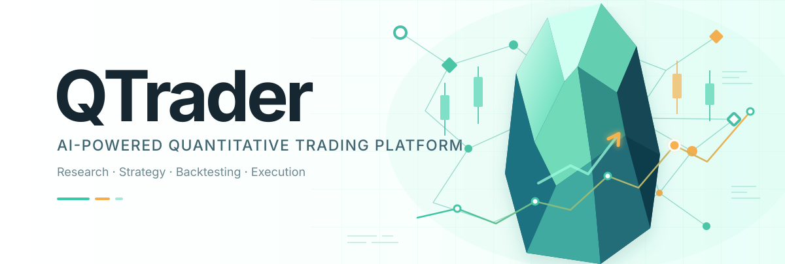

# QTrader

<p align="center">
  
</p>

**[简体中文](README.zh-CN.md)** | **[English](README.en.md)** | **[Français](README.fr.md)** | **[Deutsch](README.de.md)** | **[Español](README.es.md)** | **[日本語](README.ja.md)** | **[한국어](README.ko.md)**

---

## Introducción

Una plataforma completa de trading cuantitativo construida sobre el ecosistema [Qlib](https://github.com/microsoft/qlib), con múltiples fuentes de datos, entrenamiento y backtesting de modelos de IA, trading simulado/en vivo y control de riesgo en tiempo real.

### Características

- **Múltiples fuentes de datos**: Abstracción unificada AKShare / Qlib con cambio en caliente en tiempo de ejecución y caché incremental SQLite
- **Datos a nivel de minuto**: Sincronización y consulta de K-lines de 1/5/15/30/60 minutos, sincronización automática APScheduler tras el cierre del mercado
- **Motor de entrenamiento de IA**: Conecta el ecosistema Qlib — soporta 15 modelos (LightGBM / XGBoost / CatBoost / Linear / GRU / LSTM / ALSTM / Transformer / TCN / TabNet / DNN / GATs / SFM / DoubleEnsemble / **HFLGBModel**)
- **Modelo de alta frecuencia**: HFLGBModel + HighFreqHandler, entrenado con datos de 1 minuto con ejecución amortiguada de posiciones (REBALANCE_INTERVAL=5, BUFFER_ZONE=2)
- **Panel de entrenamiento**: Gráficos de análisis de señal de 6 dimensiones (Loss / RankIC / RankICIR / NAV Long-Short / Retornos por decil / Turnover) + métricas HF específicas (retorno por turnover / descomposición de costos / vida media de señal / curva de capacidad)
- **Backtest de cartera**: TopkDropoutStrategy (topk=30, n_drop=3) + ejecución VWAP + turnover real + retorno anualizado/Sharpe/drawdown máximo/IR
- **Predicción de una acción**: Cargar modelos entrenados para generar puntuaciones de predicción + señal alcista/bajista + fuerza (enrutamiento automático de modelos HF al camino de minutos)
- **Versionado de modelos**: Modelos entrenados persistidos automáticamente con versionado incremental, consultables por trabajo y descargables
- **Calificación por estrellas**: Calificar modelos entrenados de 1 a 5 estrellas, persistidos para facilitar la selección
- **Motor de backtesting**: Estrategia TopkDropout + evaluador (Sharpe, drawdown máximo, Calmar, IR) con gráficos Plotly + comparación multi-estrategia
- **Módulo de trading**: SimBroker emparejamiento en memoria (T+1) + integración de API EastMoney jvQuant
- **Control de riesgo**: Límite por orden / tope diario de operaciones / ratio de posición / filtro de límite al alza / interruptor de pérdida diaria
- **Motor de estrategia**: Señal → filtro de riesgo → ejecución de orden con rebalanceo programado + registros de ejecución
- **Persistencia de trabajos**: Trabajos de entrenamiento/backtest almacenados en SQLite (predeterminado) o PostgreSQL
- **Progreso en tiempo real**: Porcentaje de progreso + línea de tiempo de registros + push WebSocket
- **Lector local de K-lines**: Leer archivos .bin de Qlib directamente sin solicitudes de red, soporta cambio hfq/raw
- **Punto de control de sincronización**: Reanudación exacta tras interrupción, evitando descargas duplicadas
- **Gestión de servicios**: Script `qtrader.sh` de un comando (start / stop / restart / status / logs)

### Pila tecnológica

| Capa | Tecnología |
|---|---|
| Backend | FastAPI + Pydantic v2 + Uvicorn |
| Frontend | React 18 + TypeScript + Vite 6 + Ant Design 5 + Zustand |
| Visualización | Plotly + Lightweight Charts |
| IA/ML | Qlib + LightGBM + XGBoost + CatBoost + PyTorch (GRU/LSTM/Transformer/TCN/GATs) |
| Almacenamiento | SQLite / PostgreSQL (trabajos) + Sistema de archivos (modelos) |

### Inicio rápido

**Requisitos**: Python 3.10+ / Node.js 18+ / Datos Qlib (`~/.qlib/qlib_data/cn_data`)

```bash
git clone https://github.com/shark8848/sharkyai-qtrader.git
cd sharkyai-qtrader

pip install -r requirements.txt

cd frontend && npm install && cd ..

./qtrader.sh start
```

| Servicio | URL |
|---|---|
| Frontend | http://localhost:5173 |
| API Backend | http://localhost:8000 |
| Documentación API | http://localhost:8000/docs |

Puertos personalizados: `QTRADER_PORT=9000 QTRADER_FE_PORT=3000 ./qtrader.sh start`

### Resumen de la API

**Gestión de datos** `/api/data`
- `GET /sources` — Listar fuentes de datos disponibles
- `POST /switch` — Cambiar la fuente de datos activa
- `GET /stocks` — Obtener lista de acciones
- `GET /kline` — Obtener datos K-line
- `POST /sync_minute` — Sincronizar datos K-line a nivel de minuto
- `GET /sync_minute/status` — Progreso de sincronización de minutos
- `GET /minute/calendar` — Fechas con datos de minutos
- `GET /minute/{symbol}` — Obtener K-line de minutos de una acción en una fecha
- `GET /minute_stocks/{date}` — Acciones con datos de minutos en una fecha
- `GET /local_kline/{symbol}` — Leer K-line diaria .bin local

**Entrenamiento** `/api/train`
- `GET /config` — Obtener configuración de entrenamiento por defecto (modelos/handlers/mercados)
- `POST /start` — Iniciar un trabajo de entrenamiento (asíncrono)
- `GET /status/{job_id}` — Consultar progreso del entrenamiento (con registros en tiempo real)
- `GET /jobs` — Listar todos los trabajos de entrenamiento
- `DELETE /jobs/{job_id}` — Eliminar un trabajo de entrenamiento

**Gestión de modelos** `/api/models`
- `GET /` — Listar todos los modelos guardados (con información de versión)
- `GET /{model_id}` — Obtener metadatos del modelo
- `GET /by-job/{job_id}` — Encontrar modelo por trabajo de entrenamiento
- `GET /{model_id}/download` — Descargar archivo del modelo
- `DELETE /{model_id}` — Eliminar modelo
- `PATCH /{model_id}/rating?rating=N` — Establecer calificación por estrellas del modelo (0–5)

**Backtesting** `/api/backtest`
- `POST /run` — Ejecutar backtest (asíncrono)
- `GET /result/{job_id}` — Obtener resultados del backtest + gráficos
- `GET /jobs` — Listar todos los trabajos de backtest
- `POST /compare` — Comparar múltiples estrategias

**Trading** `/api/trade`
- `POST /connect` — Conectar con el broker
- `GET /status` — Estado del broker/estrategia
- `GET /balance` — Consultar saldo
- `GET /positions` — Consultar posiciones
- `POST /order` — Colocar orden (con verificación de riesgo)
- `GET /orders` — Consultar órdenes de hoy
- `POST /cancel/{order_id}` — Cancelar orden
- `POST /strategy/start` — Iniciar estrategia automática
- `POST /strategy/stop` — Detener estrategia automática
- `GET /strategy/logs` — Registros de ejecución de la estrategia

**Control de riesgo** `/api/trade/risk`
- `GET /config` — Obtener configuración de riesgo
- `PUT /config` — Actualizar configuración de riesgo
- `GET /stats` — Estadísticas de riesgo diarias

**Predicción** `/api/predict`
- `GET /data_range` — Obtener rango de fechas disponible
- `POST /run` — Predicción de una acción (detección automática HF/diario, devuelve serie de puntuaciones + señal + fuerza)
- `POST /minute` — Predicción HF a nivel de minuto (señales a nivel de barra de un día)

**WebSocket**: `ws://localhost:8000/ws` — Push en tiempo real (canales quotes / orders / training / position)

### Parámetros de riesgo

| Parámetro | Predeterminado | Descripción |
|---|---|---|
| `max_order_amount` | 100,000 | Importe máximo por orden |
| `max_daily_trades` | 50 | Operaciones diarias máximas |
| `max_position_pct` | 0.2 | Ratio de posición máximo por acción |
| `filter_limit_up` | true | Filtrar acciones en límite al alza |
| `circuit_breaker_loss` | -0.05 | Umbral del interruptor de pérdida diaria |

### Variables de entorno

Todos los ajustes soportan variables de entorno con prefijo `QTRADER_` o un archivo `.env`:

| Variable | Predeterminado | Descripción |
|---|---|---|
| `QTRADER_PORT` | 8000 | Puerto del backend |
| `QTRADER_FE_PORT` | 5173 | Puerto del frontend |
| `QTRADER_HOST` | 0.0.0.0 | Dirección de escucha del backend |
| `QTRADER_JOB_STORE_BACKEND` | sqlite | Backend de almacenamiento de trabajos (sqlite / postgresql) |
| `QTRADER_JOB_STORE_PG_DSN` | — | Cadena de conexión PostgreSQL |
| `QTRADER_BROKER_TYPE` | sim | Tipo de broker (sim / eastmoney) |

---

## Licencia

[Licencia MIT](LICENSE)
